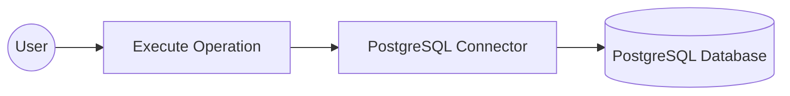
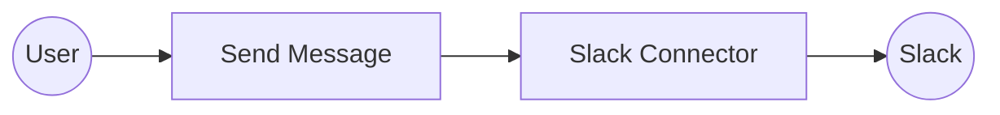
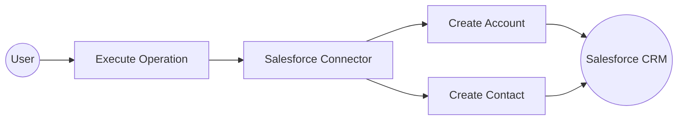

# Documentation Template

Use H2 sections as fixed structural groups. Within each section, generate as many H3 steps as the workflow actually required — one step per distinct UI action or milestone.

Step numbers run sequentially across the ENTIRE document (never reset between sections). Step descriptions are written from what actually happened — never hardcoded.

## Step Format

```markdown
### Step N: [What was done — written from the actual workflow action]
[One sentence describing what the user does in this step. If parameters were configured,
 list each on its own bullet line immediately after:]
- **[Display Label]** — [one-line description of what this parameter controls]

```

---

## Document Structure

```markdown
# Example

## What you'll build

[2–3 sentences describing: (1) the use case this integration solves, (2) which operations are
covered and what API resources will be created, (3) the overall flow assembled on the canvas.]

**Operations used:**
- **[operationName]** — [one-line description of what this operation does]
[List ALL connector-specific functions/operations configured during the workflow]

## Architecture

[Generate a horizontal Mermaid flowchart. Rules below.]

## Prerequisites

> **Omit this section entirely** if there are no connector-specific external dependencies.
> Only include when a running external service or credentials are needed.
> Do NOT list VS Code, extensions, code-server, or tooling.

- [Connector-specific prerequisites only]

## Setting up the [ConnectorName] integration

> **New to WSO2 Integrator?** Follow the [Create a New Integration](../../../../develop/create-integrations/create-new-integration.md) guide to set up your integration first, then return here to add the connector.

[No numbered steps in this section. Numbered steps begin in the next section.]

## Adding the [ConnectorName] connector

[Steps for locating and adding the connector (Category A).]

## Configuring the [ConnectorName] connection

[Steps ONLY for filling the connection form and saving (Category B).
 Ends once the connection is saved — do NOT include Automation/Listener steps here.]

### Step N: Set actual values for your configurables
Before running the integration, provide real values for the configurables you created.
In the left panel of WSO2 Integrator, click **Configurations** (listed at the bottom of the
project tree, under Data Mappers). This opens the Configurations panel where you can set
a value for each configurable:
- **[configurableName]** ([type]): [description of what value to provide]
[List every configurable created in this section]

## Configuring the [ConnectorName] [OperationName] operation

[Steps for Category C. If an entry point was added, document it as a SEPARATE step first.
 Then combine selecting the operation AND filling its parameters into ONE step.]
```

---

## Mermaid Diagram Rules

- **MANDATORY: Use `flowchart LR`** — horizontal (left-to-right). Never use TD, TB, BT, or RL.
- **MANDATORY: Minimum 4 nodes.** Split connector into separate nodes if needed to reach 4.
- **MANDATORY: No `\n` characters anywhere** — not in node labels, not in edge labels. Use a space.
- **MANDATORY: First node** = User with oval: `A((User))`
- **MANDATORY: Second node** = specific operation with rectangle: `B[Execute Operation]`
- **MANDATORY: Third node** = ConnectorName Connector with rectangle: `C[ConnectorName Connector]`
- **MANDATORY: Last node shape** depends on service type:
  - Database/cache/data storage (MySQL, Redis, BigQuery, etc.): cylinder `D[(ServiceName)]`
  - All other services (Slack, Salesforce, Kafka, etc.): circle `D((ServiceName))`
- Do NOT include WSO2 Integrator, code-server, or tooling/environment nodes.
- Use real names from the actual workflow.

**Example — database connector (4 nodes):**



**Example — non-database connector (4 nodes):**



**Example — with branching (5+ nodes):**


